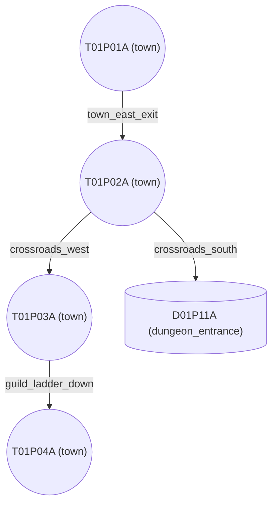

# PMD Explorers of Sky World Graph

> Représentation visuelle des connexions logiques canoniques de la NDS.

```mermaid
graph TD;
    t01p04a(("T01P04A (town)"));
    t01p03a(("T01P03A (town)"));
    t01p02a(("T01P02A (town)"));
    t01p01a(("T01P01A (town)"));
    d01p11a[("D01P11A (dungeon_entrance)")];

    t01p01a -->|"town_east_exit"| t01p02a;
    t01p02a -->|"crossroads_south"| d01p11a;
    t01p02a -->|"crossroads_west"| t01p03a;
    t01p03a -->|"guild_ladder_down"| t01p04a;
```
