# MANUEL DE PROGRESSION — PMD Explorers of Sky + Red Rescue Team (PMDO)

Renders déterministes `render_ground_png` (géométrie/tuiles réelles des .rsground importés des ROM EU). Ordre = chaîne de progression canonique, identique aux journeys runtime (GLOBAL_JOURNEY_PASS / RED_GLOBAL_JOURNEY_PASS).

---

## PARTIE 1 — Explorers of Sky (EU), CH1 → FINALE

### CH1 — Éveil sur la plage  `état 1.0`

**Donjon(s) lié(s)** : beach_cave (4 étages) → boss Koffing/Zubat (beach_cave_pit)

#### `t01p01a` — Bourg-Trésor / Treasure Town

Bourg-Trésor : hub principal, boutiques (Duskull Bank, magasin Kecleon, entrepôt Gallade).

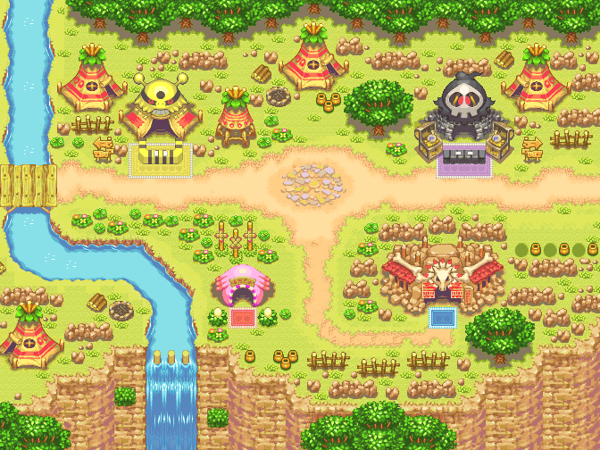

#### `p01p01a` — Croisement / Crossroads

Croisement : carrefour entre le bourg, la guilde et la plage.

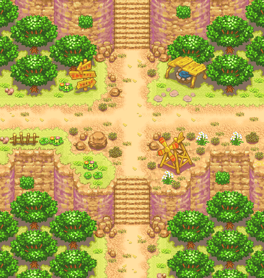

#### `d01p11b` — Plage / Beach

Plage : le héros s'éveille transformé en Pokémon ; le partenaire perd son Fragment Relique face à Koffing et Zubat — entrée du donjon Grotte Littorale.

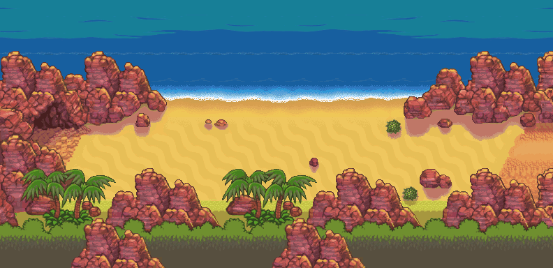

---

### CH2 — L'apprenti de la guilde  `état 3.0`

**Donjon(s) lié(s)** : drenched_bluff (6 étages) — mission Perle de Spoink

#### `g01p02a` — Entrée de la Guilde / Guild Entrance

Entrée de la Guilde de Grodoudou : la grille d'examen des visiteurs (Taupiqueur).

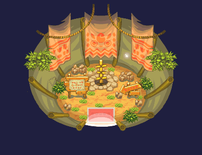

#### `g01p01b` — Guilde de Grodoudou / Wigglytuff's Guild

Guilde de Grodoudou (rez) : cérémonie d'admission ; briefing du 1er travail par Ramboum.

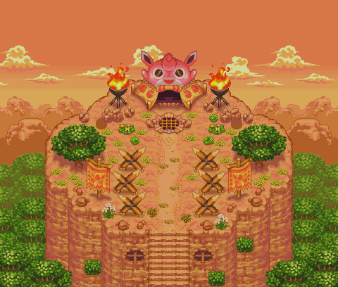

---

### CH3 — L'arrestation  `état 4.0`

**Donjon(s) lié(s)** : mt_bristle (9 étages) → boss Drowzee (mt_bristle_peak)

#### `g01p03a` — Guilde - 1[F:ER] sous-sol / Guild Sublevel 1

Guilde - 1er sous-sol : tableaux des missions et des avis de recherche ; briefing de la capture.

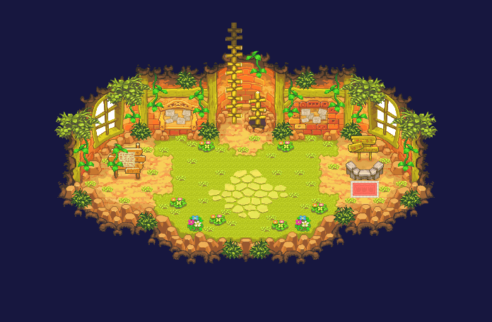

---

### CH4 — La patrouille aux Aliments  `état 5.0`

**Donjon(s) lié(s)** : waterfall_cave (8 étages) — la cascade cache une grotte

#### `g01p04a` — Guilde - 2[F:E] sous-sol / Guild Sublevel 2

Guilde - 2e sous-sol : mess et cuisine de Wigglytuff ; départ de la corvée de Perles Perche.

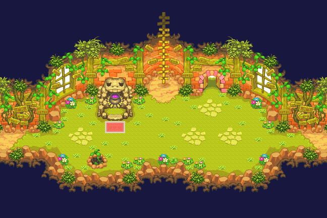

---

### CH5 — Les Baies Perche  `état 6.0`

**Donjon(s) lié(s)** : apple_woods (12 étages) — Bois aux Pommes, Groddur

#### `g01p04a` — Guilde - 2[F:E] sous-sol / Guild Sublevel 2

Guilde - 2e sous-sol : Wigglytuff envoie l'équipe chercher des Pommes Parfaites.

---

### EXPÉDITION — Le lac Brumeux  `état 8.0`

**Donjon(s) lié(s)** : craggy_coast → mt_horn → foggy_forest → steam_cave → upper_steam_cave → boss Groudon (steam_cave_peak)

#### `g01p06b` — Mess de la Guilde / Guild Mess Hall

Mess de la Guilde : annonce de la Grande Expédition, constitution des groupes.

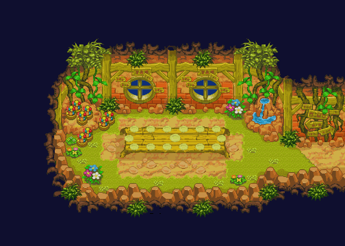

#### `d06p11a` — Côte Escarpée - entrée / Craggy Coast Entrance

Côte Escarpée - entrée : première étape de l'expédition vers le lac.

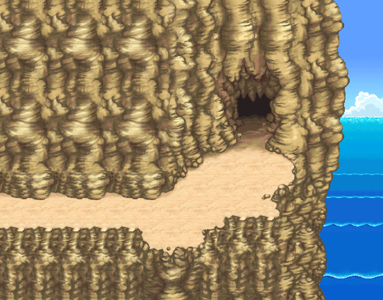

#### `d07p11a` — Mt Corne - entrée / Mt. Horn Entrance

Mt Corne - entrée : passage montagneux de l'expédition.

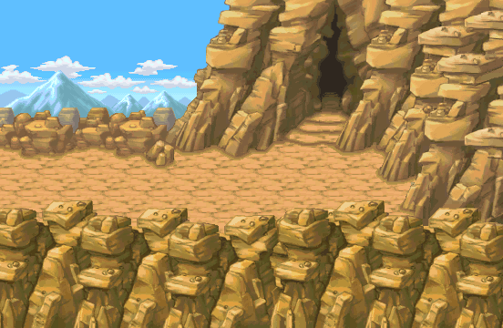

#### `d08p11a` — Camp de Base / Base Camp

Camp de Base : bivouac de l'expédition de la guilde.

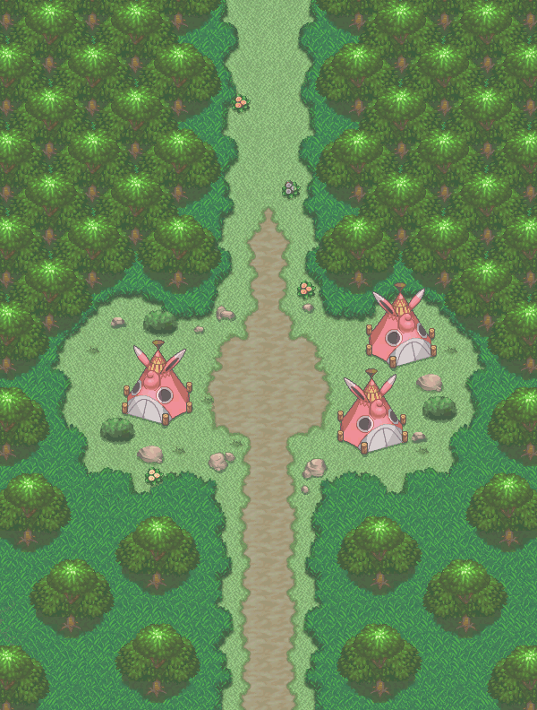

#### `d09p11a` — Grotte Etuve - entrée / Steam Cave Entrance

Grotte Étuve - entrée : dernière ligne droite vers Fogbound Lake ; Uxie et Groudon-illusion au sommet.

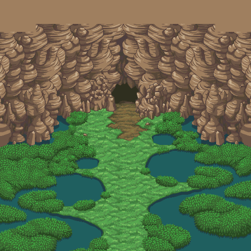

---

### CH10 — Les Plaines Élek  `état 10.0`

**Donjon(s) lié(s)** : amp_plains → far_amp_plains → boss Manectric (amp_clearing)

#### `d09p11a` — Grotte Etuve - entrée / Steam Cave Entrance

Retour d'expédition : l'équipe est envoyée aux Plaines Élek enquêter sur Grovyle.

---

### CH11 — Le Lac Souterrain  `état 11.0`

**Donjon(s) lié(s)** : northern_desert → quicksand_cave → quicksand_pit → boss Mespérit (underground_lake)

#### `g01p07a` — Dortoir / Crew Room

Dortoir : réveil de l'équipe, plan pour retrouver les Gemmes du Temps.

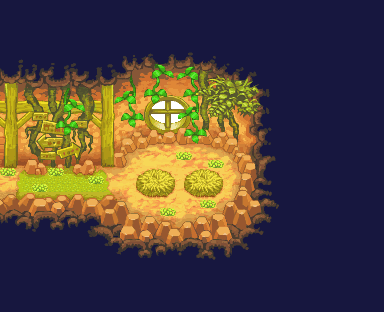

#### `d15p41a` — Lac Souterrain / Underground Lake

Lac Souterrain : la caverne de Mespérit sous le désert.

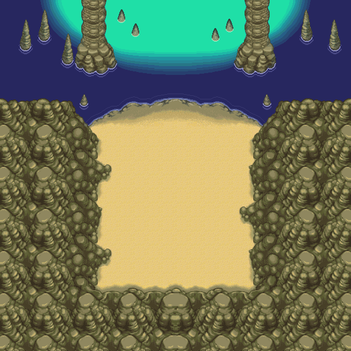

---

### CH12 — Le Lac Cristal  `état 12.0`

**Donjon(s) lié(s)** : crystal_cave → crystal_crossing → boss Grovyle (crystal_lake)

#### `g01p04a` — Guilde - 2[F:E] sous-sol / Guild Sublevel 2

Guilde - 2e sous-sol : préparation de la traque de Grovyle.

#### `d16p31a` — Caverne Cristal / Crystal Cave

Caverne Cristal : les cristaux changeants de couleur.

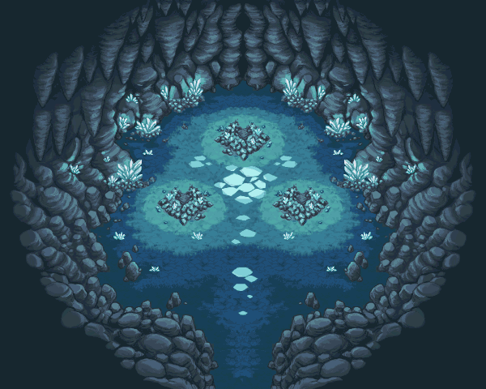

#### `d17p11a` — Lac Cristal / Shining Lake

Lac Cristal (Shining Lake) : sanctuaire de Créhelf.

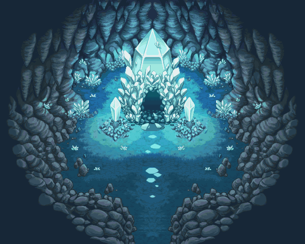

---

### FUTUR — Le monde paralysé  `état 13.0`

**Donjon(s) lié(s)** : chasm_cave → dark_hill → sealed_ruin → sealed_ruin_pit → boss Spiritomb (spiritomb_room)

#### `g01p03a` — Guilde - 1[F:ER] sous-sol / Guild Sublevel 1

Guilde - 1er sous-sol : Dusknoir emmène héros et partenaire dans le futur.

#### `d18p11a` — Grotte Abîme - entrée / Chasm Cave Entrance

Grotte Abîme - entrée (futur) : fuite avec Grovyle.

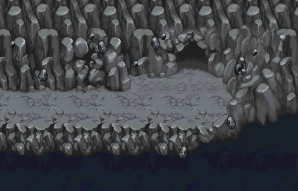

#### `d19p11a` — Colline Sombre - entrée / Dark Hill Entrance

Colline Sombre - entrée (futur) : la planète paralysée.

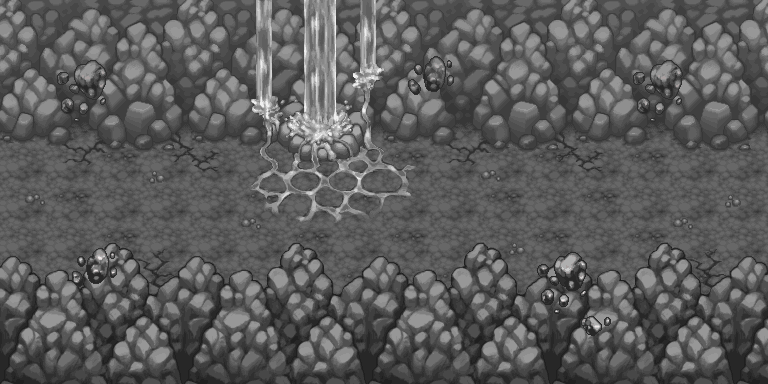

#### `d20p11a` — Ruine Scellée - entrée / Sealed Ruin Entrance

Ruine Scellée - entrée (futur) : vers Spiritomb.

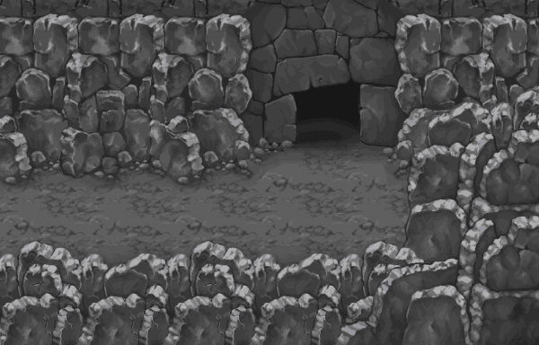

---

### CH15 — La Forêt Crépuscule  `état 15.0`

**Donjon(s) lié(s)** : dusk_forest → deep_dusk_forest → treeshroud_forest (20 étages)

#### `d22p11a` — Forêt Crépuscule - entrée / Dusk Forest Entrance

Forêt Crépuscule - entrée : retour au présent, quête des Gemmes du Temps avec Grovyle.

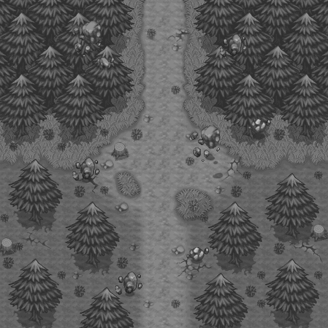

#### `d23p11a` — Cœur Forêt Crépuscule / Deep Dusk Forest Entrance

Cœur de la Forêt Crépuscule : la brume s'épaissit.

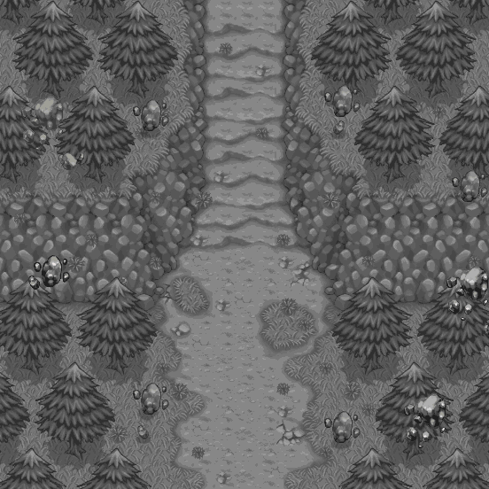

#### `d24p11a` — Forêt Linceul - entrée / Treeshroud Forest Entrance

Forêt Linceul - entrée : la 3e Gemme du Temps.

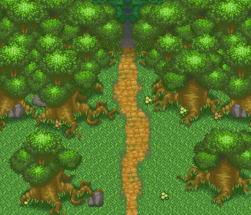

---

### CH17 — La Caverne Saline  `état 17.0`

**Donjon(s) lié(s)** : brine_cave → lower_brine_cave → boss Omastar/Kabutops (brine_cave_pit)

#### `p05p02a` — Prison / Jail Cell

Prison de la guilde : l'équipe détenue après le quiproquo Grovyle/Dusknoir.

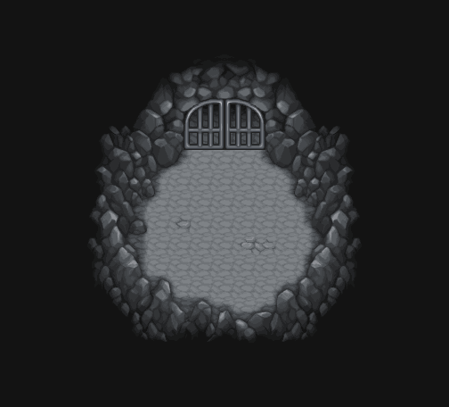

#### `d25p11a` — Caverne Saline - entrée / Brine Cave Entrance

Caverne Saline - entrée : sur les traces de Grodoudou et du repaire des bandits.

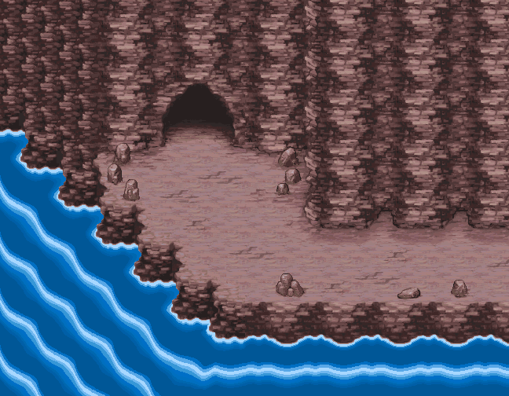

---

### CH18 — Les Terres Illusoires  `état 18.0`

**Donjon(s) lié(s)** : hidden_land → hidden_highland → boss Dusknoir+Sabelette (old_ruins)

#### `d27p11a` — Terres Illusoires - entrée / Hidden Land Entrance

Terres Illusoires - entrée : au-delà de la mer, le domaine caché de Lapras.

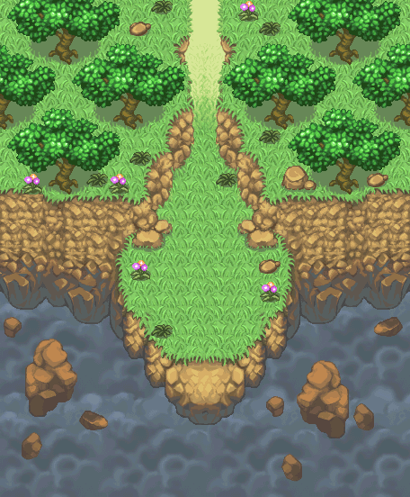

#### `d28p31a` — Ruines Anciennes / Old Ruins

Ruines Anciennes (Old Ruins) : l'affrontement contre Dusknoir avant la Tour du Temps.

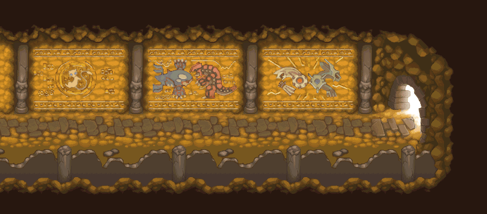

---

### FINALE — La Tour du Temps  `état 20.0`

**Donjon(s) lié(s)** : temporal_tower → temporal_spire → boss DIALGA (temporal_pinnacle, plateforme entourée de vide — fixed floor 10)

#### `d01p11a` — Plage / Beach

Plage : adieux et départ vers la Tour du Temps.

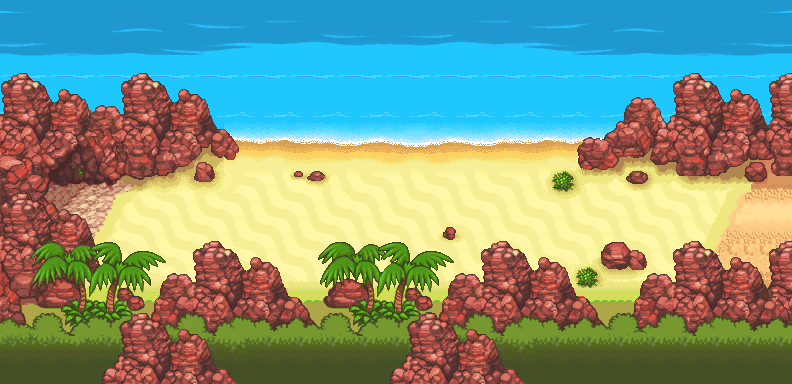

#### `d29p11a` — Tour du Temps - entrée / Temporal Tower Entrance

Tour du Temps - entrée : l'ascension finale pour sauver le temps.

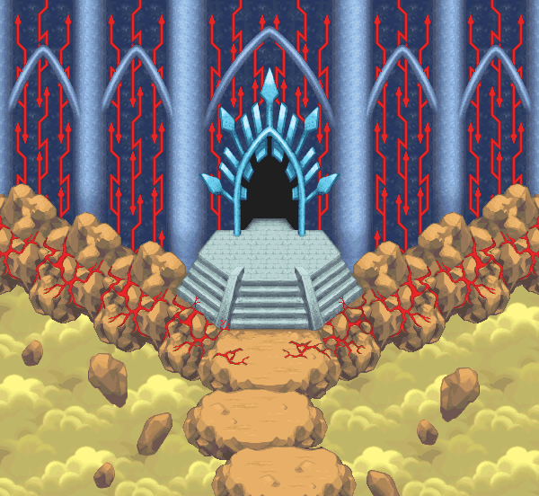

---

## PARTIE 2 — Red Rescue Team (EU), CH1 → CH13

### CH1 — Tiny Woods

**Donjon(s) lié(s)** : tiny_woods (3 étages)

#### `t01p01`

Place du village (Pokémon Square) : hub Red — Kecleon, Kangaskhan, Persian Bank.

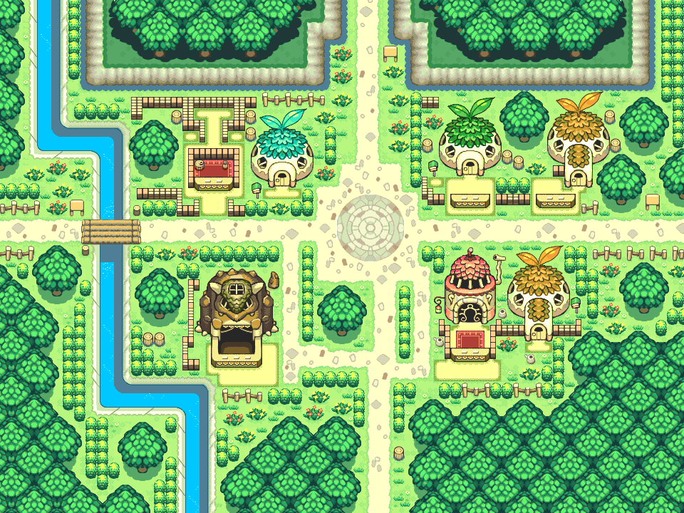

#### `d01p01`

Entrée de Tiny Woods : sauvetage de Caterpie pour Butterfree.

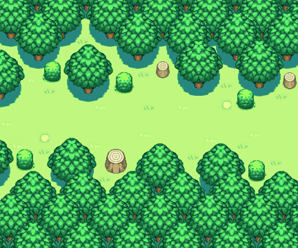

---

### CH2 — Thunderwave Cave

**Donjon(s) lié(s)** : thunderwave_cave (5 étages)

#### `d02p01`

Entrée de Thunderwave Cave : sauvetage des Magnemite coincés.

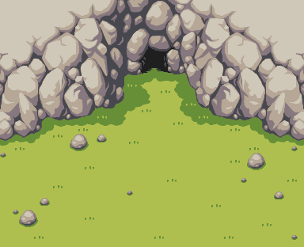

---

### CH3 — Mt Steel

**Donjon(s) lié(s)** : mt_steel (8 étages) → boss SKARMORY (fixed room GBA, décor pixel-exact d03p02)

#### `d03p01`

Entrée du Mont Acier : Diglett kidnappé par Skarmory.

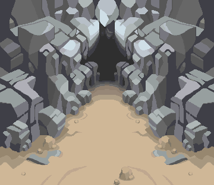

---

### CH4 — Sinister Woods

**Donjon(s) lié(s)** : gloomy_forest (6+6 étages, 2 segments)

#### `d04p01`

Entrée des Bois Sinistres : l'embuscade de la Team Meanies (Gengar, Ekans, Medicham) dans la clairière.

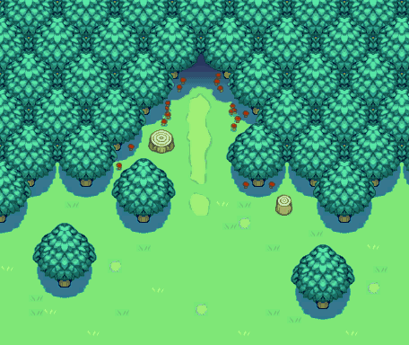

---

### CH5 — Silent Chasm

**Donjon(s) lié(s)** : silent_chasm (9 étages)

#### `d05p01`

Entrée du Gouffre Silencieux : Shiftry disparu.

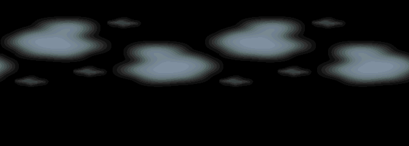

---

### CH6 — Mt Thunder

**Donjon(s) lié(s)** : mt_thunder → mt_thunder_peak → boss ZAPDOS

#### `d06p01`

Entrée du Mont Tonnerre : la rumeur accuse le héros ; Zapdos retient Shiftry au sommet.

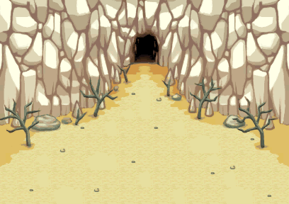

---

### CH7 — Great Canyon

**Donjon(s) lié(s)** : great_canyon (12 étages)

#### `d07p01`

Entrée du Grand Canyon : rencontre de Xatu et révélation de la prophétie de Ninetales.

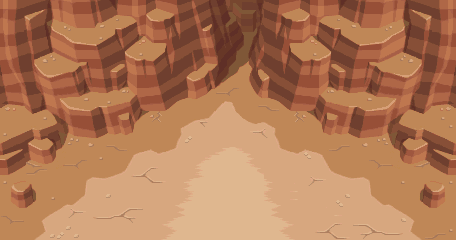

---

### CH8 — Lapis Cave

**Donjon(s) lié(s)** : lapis_cave (14 étages)

#### `d08p01`

Entrée de la Grotte Lapis : la fuite commence, le village croit le héros maudit.

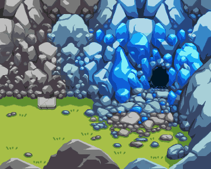

---

### CH9 — Mt Blaze

**Donjon(s) lié(s)** : mt_blaze → mt_blaze_peak → boss MOLTRES

#### `d09p01`

Entrée du Mont Brasier : la fuite continue vers le nord ; Moltres barre le passage au pic.

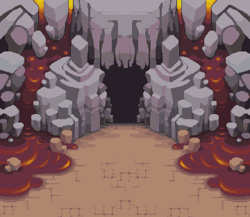

---

### CH10 — Frosty Forest

**Donjon(s) lié(s)** : frosty_forest (8 étages)

#### `d10p01`

Entrée de la Forêt Givrée : la traversée glaciale des fugitifs.

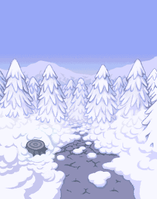

---

### CH11 — Mt Freeze

**Donjon(s) lié(s)** : mt_freeze → mt_freeze_peak → boss GLALIE

#### `d11p01`

Entrée du Mont Gel : Ninetales révèle la vérité ; affrontement contre Glalie (Alakazam interrompt).

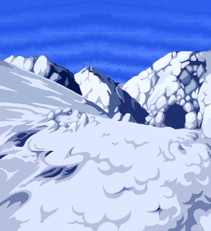

---

### CH12 — Magma Cavern

**Donjon(s) lié(s)** : magma_cavern (8+7+8) → magma_cavern_pit (3) → boss GROUDON (fixed room GBA fr7, poches de lave restaurées)

#### `d15p01`

Entrée de la Caverne Magma : Groudon s'éveille sous terre ; l'équipe réhabilitée part le neutraliser.

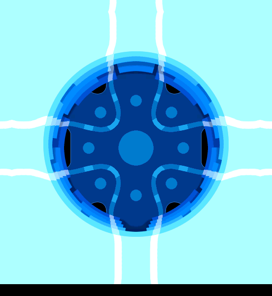

---

### CH13 — Sky Tower (FINALE)

**Donjon(s) lié(s)** : sky_tower (25) → sky_tower_summit (9) → boss RAYQUAZA (fixed room GBA fr8, plateforme céleste + ciel)

#### `d16p01`

Entrée de la Tour Céleste : l'étoile menace de s'écraser ; Rayquaza seul peut la détruire.

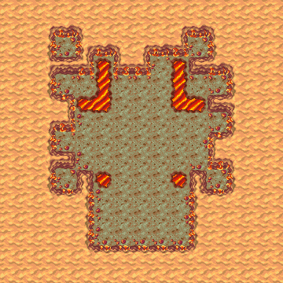

---
