# PMD Red EU — direct dungeon-to-Ground reconstruction

This illustrated evidence bundle was regenerated from the authoritative European GBA ROM. It covers the exact 27 Ground records whose visuals are replaced at runtime through `GroundMap_SelectDungeon → sub_80A3440 → sub_80ADD9C`.

- ROM SHA-256: `0f9d125d513d9cba628d97e2c345382eba9ba73b402b24a8fdd81f604c14cbcd`
- Direct mappings: **27**
- Strict AT4PX differentials: **204 / 204 matched SkyTemple**
- Playable floor counts below are selector-row count minus the mandatory dummy row 0.
- APNGs are exact bounded startup-prefix previews. The JSON beside each image preserves all 32 independent cycle records and exact full steady-cycle lengths; no global LCM was expanded.

> **Scope boundary:** These images prove this graphical runtime path. They do not by themselves certify music, scripts, collision, entrances, exits, or PMDO installation; those remain separate reconstruction/validation stages.

## Relationship index

| Ground | Canonical French dungeon | Floors | Selected floor row | Tileset | Role | Tick 0 | Preview |
|---|---|---:|---:|---:|---|---|---|
| `d01p02` | Petit Bois | 3 | 3 | 14 | `ending_ground` | [PNG](d01p02/tick0.png) | [PNG/APNG](d01p02/animation.png) |
| `d02p02` | Grotte Eclair | 5 | 5 | 50 | `ending_ground` | [PNG](d02p02/tick0.png) | [PNG/APNG](d02p02/animation.png) |
| `d03p02` | Mt Acier | 9 | 9 | 64 | `ending_ground` | [PNG](d03p02/tick0.png) | [PNG/APNG](d03p02/animation.png) |
| `d04p02` | Bois Sinistre | 13 | 13 | 65 | `ending_ground` | [PNG](d04p02/tick0.png) | [PNG/APNG](d04p02/animation.png) |
| `d05p02` | Val Silencieux | 9 | 9 | 2 | `ending_ground` | [PNG](d05p02/tick0.png) | [PNG/APNG](d05p02/animation.png) |
| `d06p02` | Mt Foudre | 10 | 10 | 42 | `midpoint_relay_ground` | [PNG](d06p02/tick0.png) | [PNG/APNG](d06p02/animation.png) |
| `d06p03` | Mt Foudre-Pic | 3 | 3 | 66 | `ending_ground` | [PNG](d06p03/tick0.png) | [PNG/APNG](d06p03/animation.png) |
| `d09p02` | Mt Ardent | 12 | 12 | 46 | `midpoint_relay_ground` | [PNG](d09p02/tick0.png) | [PNG/APNG](d09p02/animation.png) |
| `d09p03` | Mt Ardent-Pic | 3 | 3 | 67 | `ending_ground` | [PNG](d09p03/tick0.png) | [PNG/APNG](d09p03/animation.png) |
| `d10p02` | Forêt Givrée | 9 | 9 | 36 | `midpoint_relay_ground` | [PNG](d10p02/tick0.png) | [PNG/APNG](d10p02/animation.png) |
| `d10p03` | Sous-Bois Givré | 5 | 5 | 68 | `ending_ground` | [PNG](d10p03/tick0.png) | [PNG/APNG](d10p03/animation.png) |
| `d11p02` | Mt Glacial | 15 | 15 | 47 | `midpoint_relay_ground` | [PNG](d11p02/tick0.png) | [PNG/APNG](d11p02/animation.png) |
| `d11p03` | Mt Glacial-Pic | 5 | 5 | 69 | `ending_ground` | [PNG](d11p03/tick0.png) | [PNG/APNG](d11p03/animation.png) |
| `d12p02` | Mine Magma | 23 | 23 | 48 | `midpoint_relay_ground` | [PNG](d12p02/tick0.png) | [PNG/APNG](d12p02/animation.png) |
| `d12p04` | Mine Magma-Fond | 3 | 3 | 70 | `ending_ground` | [PNG](d12p04/tick0.png) | [PNG/APNG](d12p04/animation.png) |
| `d13p02` | Tour Céleste | 25 | 25 | 35 | `midpoint_relay_ground` | [PNG](d13p02/tick0.png) | [PNG/APNG](d13p02/animation.png) |
| `d13p03` | Tour Céleste-Sommet | 9 | 9 | 71 | `ending_ground` | [PNG](d13p03/tick0.png) | [PNG/APNG](d13p03/animation.png) |
| `d14p01` | Mer Houleuse | 40 | 40 | 74 | `fixed_dungeon_ground` | [PNG](d14p01/tick0.png) | [PNG/APNG](d14p01/animation.png) |
| `d15p01` | Fosse d'Argent | 99 | 99 | 73 | `fixed_dungeon_ground` | [PNG](d15p01/tick0.png) | [PNG/APNG](d15p01/animation.png) |
| `d16p01` | Terres de Feu | 30 | 30 | 59 | `fixed_dungeon_ground` | [PNG](d16p01/tick0.png) | [PNG/APNG](d16p01/animation.png) |
| `d17p01` | Terres de Foudre | 30 | 30 | 29 | `fixed_dungeon_ground` | [PNG](d17p01/tick0.png) | [PNG/APNG](d17p01/animation.png) |
| `d18p01` | Terres Blizzard | 30 | 30 | 9 | `fixed_dungeon_ground` | [PNG](d18p01/tick0.png) | [PNG/APNG](d18p01/animation.png) |
| `d19p01` | Pic Inaccessible | 40 | 40 | 72 | `fixed_dungeon_ground` | [PNG](d19p01/tick0.png) | [PNG/APNG](d19p01/animation.png) |
| `d20p01` | Grotte Ouest | 99 | 99 | 38 | `fixed_dungeon_ground` | [PNG](d20p01/tick0.png) | [PNG/APNG](d20p01/animation.png) |
| `d21p01` | Mts Septentrion | 25 | 25 | 75 | `fixed_dungeon_ground` | [PNG](d21p01/tick0.png) | [PNG/APNG](d21p01/animation.png) |
| `d23p01` | Grotte des Voeux | 99 | 20 | 7 | `fixed_dungeon_ground` | [PNG](d23p01/tick0.png) | [PNG/APNG](d23p01/animation.png) |
| `d25p01` | Bois Hurlement | 15 | 15 | 61 | `fixed_dungeon_ground` | [PNG](d25p01/tick0.png) | [PNG/APNG](d25p01/animation.png) |

## Ground evidence

### `d01p02` — Petit Bois

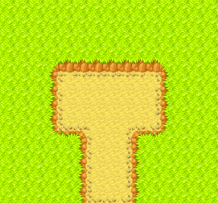

- **Relationship:** `ending_ground` (pret/pmd-red ground-map enum role, applied to the exact EU mapping row).
- **Dungeon:** ID 0, official French strings “Petit Bois” / “Petit Bois”, 3 playable floors.
- **Floor selection:** requested floor value `100`, runtime-clamped selector row `3`, property `2`, canonical tileset **14**.
- **Graphics resources:** tileset 14 uses graphics index 14 for FON/CEL/material; palette and CANM remain on tileset 14.
- **Equivalent base-game Ground geometry:** camera 45×42 tiles (360×336 px), source material grid 15×14 chunks, retained runtime material stride **64**.
- **Composition:** `regular_cex_neighborhood`; deterministic CEX variant `0` with out-of-bounds terrain default `0`.
- **Tick-zero PNG SHA-256:** `7a0123ab9863d253efed686e2e351a70955e41565b1883e52f79fb570d2e6777`.
- **Runtime chunk map SHA-256:** `a99617dd108b27ab4370e62702867537047d634150d63a5d71daceefc2d89a4e`.
- Detailed byte spans, source hashes, cycle records, and frame hashes: [`evidence.json`](d01p02/evidence.json), [`animation.json`](d01p02/animation.json).

### `d02p02` — Grotte Eclair

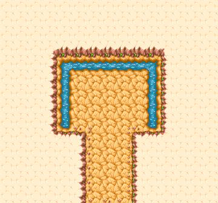

- **Relationship:** `ending_ground` (pret/pmd-red ground-map enum role, applied to the exact EU mapping row).
- **Dungeon:** ID 1, official French strings “Grotte Eclair” / “Grotte Eclair”, 5 playable floors.
- **Floor selection:** requested floor value `100`, runtime-clamped selector row `5`, property `7`, canonical tileset **50**.
- **Graphics resources:** tileset 50 uses graphics index 50 for FON/CEL/material; palette and CANM remain on tileset 50.
- **Equivalent base-game Ground geometry:** camera 45×42 tiles (360×336 px), source material grid 15×14 chunks, retained runtime material stride **64**.
- **Composition:** `regular_cex_neighborhood`; deterministic CEX variant `0` with out-of-bounds terrain default `0`.
- **Tick-zero PNG SHA-256:** `df081810611be22a53575ff385bb74defb3371ef54d00d367be11f36c70c40fe`.
- **Runtime chunk map SHA-256:** `eca8a93895371c8b66f3865c57e6ef980671d753811755c14449e557181ee9fd`.
- Detailed byte spans, source hashes, cycle records, and frame hashes: [`evidence.json`](d02p02/evidence.json), [`animation.json`](d02p02/animation.json).

### `d03p02` — Mt Acier

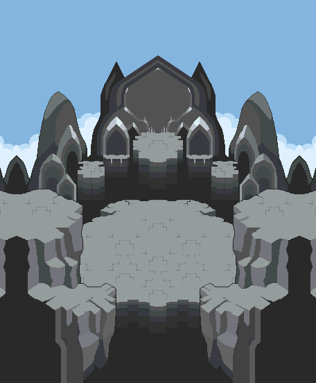

- **Relationship:** `ending_ground` (pret/pmd-red ground-map enum role, applied to the exact EU mapping row).
- **Dungeon:** ID 2, official French strings “Mt Acier” / “Mt Acier”, 9 playable floors.
- **Floor selection:** requested floor value `100`, runtime-clamped selector row `9`, property `16`, canonical tileset **64**.
- **Graphics resources:** tileset 64 uses graphics index 64 for FON/CEL/material; palette and CANM remain on tileset 64.
- **Equivalent base-game Ground geometry:** camera 57×69 tiles (456×552 px), source material grid 19×23 chunks, retained runtime material stride **64**.
- **Composition:** `special_emap_direct`; the selected special EMAP supplies canonical chunks directly.
- **Tick-zero PNG SHA-256:** `5ffaf5add9cf2115f4bdf6f72e4ce0e55dd6572b973a82a58e789ad366b1ab57`.
- **Runtime chunk map SHA-256:** `1d978d09d1f0fd4f3b370581f82d790fb7d3cc8933d5cd5f2435597f6a55fb50`.
- Detailed byte spans, source hashes, cycle records, and frame hashes: [`evidence.json`](d03p02/evidence.json), [`animation.json`](d03p02/animation.json).

### `d04p02` — Bois Sinistre

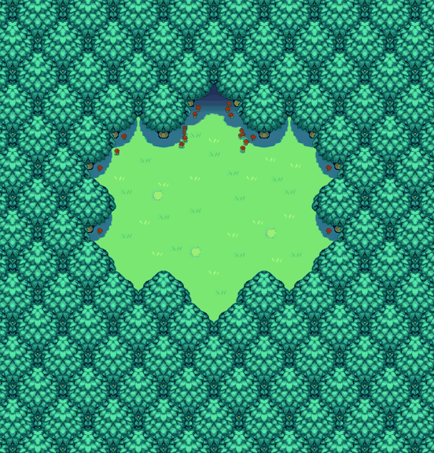

- **Relationship:** `ending_ground` (pret/pmd-red ground-map enum role, applied to the exact EU mapping row).
- **Dungeon:** ID 3, official French strings “Bois Sinistre” / “Bois Sinistre”, 13 playable floors.
- **Floor selection:** requested floor value `100`, runtime-clamped selector row `13`, property `29`, canonical tileset **65**.
- **Graphics resources:** tileset 65 uses graphics index 65 for FON/CEL/material; palette and CANM remain on tileset 65.
- **Equivalent base-game Ground geometry:** camera 69×72 tiles (552×576 px), source material grid 23×24 chunks, retained runtime material stride **64**.
- **Composition:** `special_emap_direct`; the selected special EMAP supplies canonical chunks directly.
- **Tick-zero PNG SHA-256:** `2a7a1e4fe072b6a8b640dd12c6e5c9ff5b44bc49184c6653919e6b231f5f0e1d`.
- **Runtime chunk map SHA-256:** `9f7a21fdedf68e1d2095f45d86ea2c2c12ae38f90a42fb541452086d18913f1e`.
- Detailed byte spans, source hashes, cycle records, and frame hashes: [`evidence.json`](d04p02/evidence.json), [`animation.json`](d04p02/animation.json).

### `d05p02` — Val Silencieux

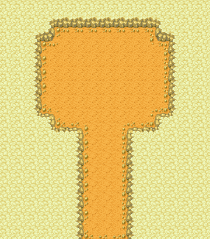

- **Relationship:** `ending_ground` (pret/pmd-red ground-map enum role, applied to the exact EU mapping row).
- **Dungeon:** ID 4, official French strings “Val Silencieux” / “Val Silencieux”, 9 playable floors.
- **Floor selection:** requested floor value `100`, runtime-clamped selector row `9`, property `38`, canonical tileset **2**.
- **Graphics resources:** tileset 2 uses graphics index 2 for FON/CEL/material; palette and CANM remain on tileset 2.
- **Equivalent base-game Ground geometry:** camera 45×51 tiles (360×408 px), source material grid 15×17 chunks, retained runtime material stride **64**.
- **Composition:** `regular_cex_neighborhood`; deterministic CEX variant `0` with out-of-bounds terrain default `0`.
- **Tick-zero PNG SHA-256:** `110b473f97d5bff2c95453198d2b454971bcedd674e4ccbb67e66125efc5e0d4`.
- **Runtime chunk map SHA-256:** `6e938fe6af3659c67ac3ee1000c5d864c26b3a8cf37f6e050b293b2881750365`.
- Detailed byte spans, source hashes, cycle records, and frame hashes: [`evidence.json`](d05p02/evidence.json), [`animation.json`](d05p02/animation.json).

### `d06p02` — Mt Foudre

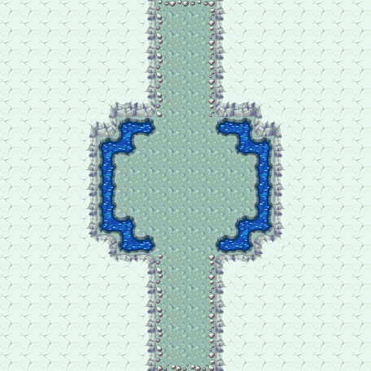

- **Relationship:** `midpoint_relay_ground` (pret/pmd-red ground-map enum role, applied to the exact EU mapping row).
- **Dungeon:** ID 5, official French strings “Mt Foudre” / “Mt Foudre”, 10 playable floors.
- **Floor selection:** requested floor value `100`, runtime-clamped selector row `10`, property `48`, canonical tileset **42**.
- **Graphics resources:** tileset 42 uses graphics index 42 for FON/CEL/material; palette and CANM remain on tileset 42.
- **Equivalent base-game Ground geometry:** camera 57×57 tiles (456×456 px), source material grid 19×19 chunks, retained runtime material stride **64**.
- **Composition:** `regular_cex_neighborhood`; deterministic CEX variant `0` with out-of-bounds terrain default `0`.
- **Tick-zero PNG SHA-256:** `3c3cadc3e146e34b2c932f1e882713af2fa9c42edbbc5944d71c9fbf254bc587`.
- **Runtime chunk map SHA-256:** `0b69dcc08084cd809699b23f389a7dc51d0400bd737bb2d2edc978efa990f6db`.
- Detailed byte spans, source hashes, cycle records, and frame hashes: [`evidence.json`](d06p02/evidence.json), [`animation.json`](d06p02/animation.json).

### `d06p03` — Mt Foudre-Pic

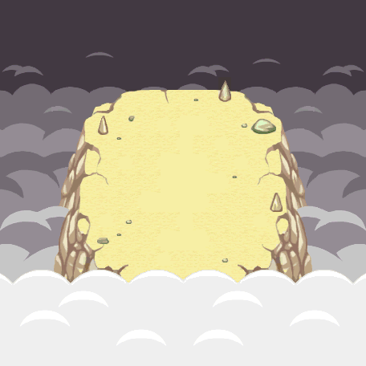

- **Relationship:** `ending_ground` (pret/pmd-red ground-map enum role, applied to the exact EU mapping row).
- **Dungeon:** ID 6, official French strings “Mt Foudre-Pic” / “Mt Foudre-Pic”, 3 playable floors.
- **Floor selection:** requested floor value `100`, runtime-clamped selector row `3`, property `51`, canonical tileset **66**.
- **Graphics resources:** tileset 66 uses graphics index 66 for FON/CEL/material; palette and CANM remain on tileset 66.
- **Equivalent base-game Ground geometry:** camera 57×57 tiles (456×456 px), source material grid 19×19 chunks, retained runtime material stride **64**.
- **Composition:** `special_emap_direct`; the selected special EMAP supplies canonical chunks directly.
- **Tick-zero PNG SHA-256:** `345fc8c1f11c7b5520759b821156a91bfad6faa89aadd9dca2133a5da3604dbd`.
- **Runtime chunk map SHA-256:** `13950a00d0a3dcd53d63d61c45b5fa0919ba2ce6a7c58aac6d3efaed739db636`.
- Detailed byte spans, source hashes, cycle records, and frame hashes: [`evidence.json`](d06p03/evidence.json), [`animation.json`](d06p03/animation.json).

### `d09p02` — Mt Ardent

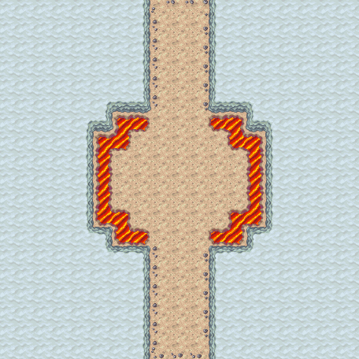

- **Relationship:** `midpoint_relay_ground` (pret/pmd-red ground-map enum role, applied to the exact EU mapping row).
- **Dungeon:** ID 9, official French strings “Mt Ardent” / “Mt Ardent”, 12 playable floors.
- **Floor selection:** requested floor value `100`, runtime-clamped selector row `12`, property `89`, canonical tileset **46**.
- **Graphics resources:** tileset 46 uses graphics index 46 for FON/CEL/material; palette and CANM remain on tileset 46.
- **Equivalent base-game Ground geometry:** camera 57×57 tiles (456×456 px), source material grid 19×19 chunks, retained runtime material stride **64**.
- **Composition:** `regular_cex_neighborhood`; deterministic CEX variant `0` with out-of-bounds terrain default `0`.
- **Tick-zero PNG SHA-256:** `ed018d5f1191e8996f1e39849ded04c989e3419364b4b12c50a26d124e7a0ee0`.
- **Runtime chunk map SHA-256:** `0a6f6d28bfdfd89355b4e40471a92e3f23c82c2d7cea68ba4b33c6cc3391ebdb`.
- Detailed byte spans, source hashes, cycle records, and frame hashes: [`evidence.json`](d09p02/evidence.json), [`animation.json`](d09p02/animation.json).

### `d09p03` — Mt Ardent-Pic

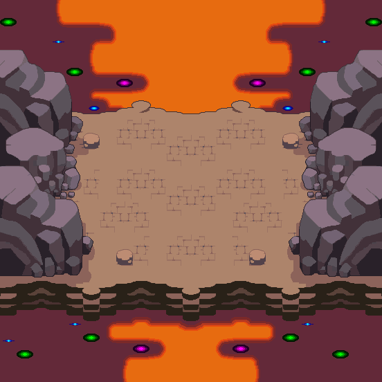

- **Relationship:** `ending_ground` (pret/pmd-red ground-map enum role, applied to the exact EU mapping row).
- **Dungeon:** ID 10, official French strings “Mt Ardent-Pic” / “Mt Ardent-Pic”, 3 playable floors.
- **Floor selection:** requested floor value `100`, runtime-clamped selector row `3`, property `92`, canonical tileset **67**.
- **Graphics resources:** tileset 67 uses graphics index 67 for FON/CEL/material; palette and CANM remain on tileset 67.
- **Equivalent base-game Ground geometry:** camera 69×69 tiles (552×552 px), source material grid 23×23 chunks, retained runtime material stride **64**.
- **Composition:** `special_emap_direct`; the selected special EMAP supplies canonical chunks directly.
- **Tick-zero PNG SHA-256:** `21f9d3c821cdb480b82be38b6c89b9a26250f653a45ccd6f4695bc92a0f40e94`.
- **Runtime chunk map SHA-256:** `90c2908eee6b11db6f4fe3a18f4732cce5f5dfe509d3cf4ec3a3d6cbdd3c09e4`.
- Detailed byte spans, source hashes, cycle records, and frame hashes: [`evidence.json`](d09p03/evidence.json), [`animation.json`](d09p03/animation.json).

### `d10p02` — Forêt Givrée

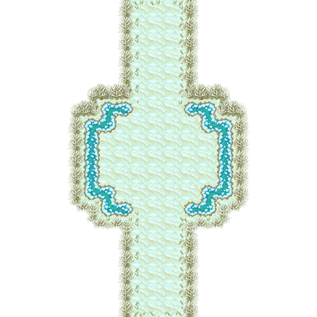

- **Relationship:** `midpoint_relay_ground` (pret/pmd-red ground-map enum role, applied to the exact EU mapping row).
- **Dungeon:** ID 11, official French strings “Forêt Givrée” / “Forêt Givrée”, 9 playable floors.
- **Floor selection:** requested floor value `100`, runtime-clamped selector row `9`, property `101`, canonical tileset **36**.
- **Graphics resources:** tileset 36 uses graphics index 36 for FON/CEL/material; palette and CANM remain on tileset 36.
- **Equivalent base-game Ground geometry:** camera 57×57 tiles (456×456 px), source material grid 19×19 chunks, retained runtime material stride **64**.
- **Composition:** `regular_cex_neighborhood`; deterministic CEX variant `0` with out-of-bounds terrain default `0`.
- **Tick-zero PNG SHA-256:** `e6a96f7dc6ce49160fed2e8ea63c6e10dcd50db121206900957558b4fabae0b8`.
- **Runtime chunk map SHA-256:** `ec77755ee6664758e0e462eb8e6e846a88b250efc44ab7843be897e1a83611d3`.
- Detailed byte spans, source hashes, cycle records, and frame hashes: [`evidence.json`](d10p02/evidence.json), [`animation.json`](d10p02/animation.json).

### `d10p03` — Sous-Bois Givré

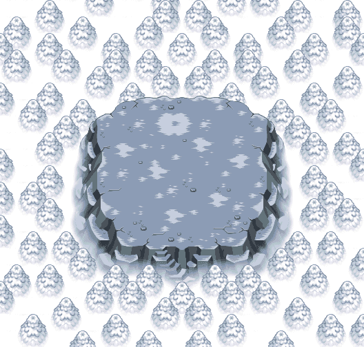

- **Relationship:** `ending_ground` (pret/pmd-red ground-map enum role, applied to the exact EU mapping row).
- **Dungeon:** ID 12, official French strings “Sous-Bois Givré” / “Sous-Bois Givré”, 5 playable floors.
- **Floor selection:** requested floor value `100`, runtime-clamped selector row `5`, property `106`, canonical tileset **68**.
- **Graphics resources:** tileset 68 uses graphics index 68 for FON/CEL/material; palette and CANM remain on tileset 68.
- **Equivalent base-game Ground geometry:** camera 66×63 tiles (528×504 px), source material grid 22×21 chunks, retained runtime material stride **64**.
- **Composition:** `special_emap_direct`; the selected special EMAP supplies canonical chunks directly.
- **Tick-zero PNG SHA-256:** `bfcc2a9bd54d1c2304a51642723439608cd6fe673abf80a1ce648e3129f366be`.
- **Runtime chunk map SHA-256:** `cb697fec889b33c4567bcefa98d39a47e72a23f63ff31675683008e6e0ace5d6`.
- Detailed byte spans, source hashes, cycle records, and frame hashes: [`evidence.json`](d10p03/evidence.json), [`animation.json`](d10p03/animation.json).

### `d11p02` — Mt Glacial

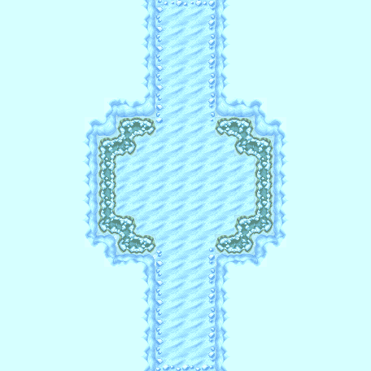

- **Relationship:** `midpoint_relay_ground` (pret/pmd-red ground-map enum role, applied to the exact EU mapping row).
- **Dungeon:** ID 13, official French strings “Mt Glacial” / “Mt Glacial”, 15 playable floors.
- **Floor selection:** requested floor value `100`, runtime-clamped selector row `15`, property `121`, canonical tileset **47**.
- **Graphics resources:** tileset 47 uses graphics index 47 for FON/CEL/material; palette and CANM remain on tileset 47.
- **Equivalent base-game Ground geometry:** camera 57×57 tiles (456×456 px), source material grid 19×19 chunks, retained runtime material stride **64**.
- **Composition:** `regular_cex_neighborhood`; deterministic CEX variant `0` with out-of-bounds terrain default `0`.
- **Tick-zero PNG SHA-256:** `f6232a5e669cec77808dcd876b7b0af067e99446988fc4f9c62fb2d8dfdcdf19`.
- **Runtime chunk map SHA-256:** `7b596695452d7c433c12ba184996b735a3f61de3b1c1d197e674bc658804f62d`.
- Detailed byte spans, source hashes, cycle records, and frame hashes: [`evidence.json`](d11p02/evidence.json), [`animation.json`](d11p02/animation.json).

### `d11p03` — Mt Glacial-Pic

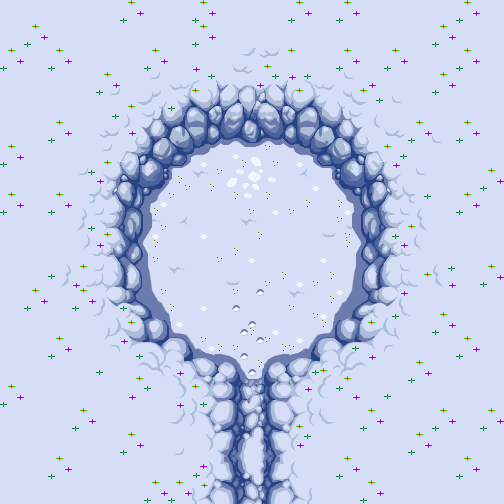

- **Relationship:** `ending_ground` (pret/pmd-red ground-map enum role, applied to the exact EU mapping row).
- **Dungeon:** ID 14, official French strings “Mt Glacial-Pic” / “Mt Glacial-Pic”, 5 playable floors.
- **Floor selection:** requested floor value `100`, runtime-clamped selector row `5`, property `126`, canonical tileset **69**.
- **Graphics resources:** tileset 69 uses graphics index 69 for FON/CEL/material; palette and CANM remain on tileset 69.
- **Equivalent base-game Ground geometry:** camera 63×63 tiles (504×504 px), source material grid 21×21 chunks, retained runtime material stride **64**.
- **Composition:** `special_emap_direct`; the selected special EMAP supplies canonical chunks directly.
- **Tick-zero PNG SHA-256:** `abdbd4bfb48de30d10783902781ad70befb48cf88cce4816874b696039bcffb2`.
- **Runtime chunk map SHA-256:** `5a2f966eaa10647ef7ff336b1f9967d41ea4a889619c983c124035a30bc38f74`.
- Detailed byte spans, source hashes, cycle records, and frame hashes: [`evidence.json`](d11p03/evidence.json), [`animation.json`](d11p03/animation.json).

### `d12p02` — Mine Magma

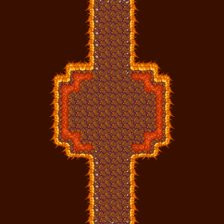

- **Relationship:** `midpoint_relay_ground` (pret/pmd-red ground-map enum role, applied to the exact EU mapping row).
- **Dungeon:** ID 15, official French strings “Mine Magma” / “Mine Magma”, 23 playable floors.
- **Floor selection:** requested floor value `100`, runtime-clamped selector row `23`, property `149`, canonical tileset **48**.
- **Graphics resources:** tileset 48 uses graphics index 48 for FON/CEL/material; palette and CANM remain on tileset 48.
- **Equivalent base-game Ground geometry:** camera 57×57 tiles (456×456 px), source material grid 19×19 chunks, retained runtime material stride **64**.
- **Composition:** `regular_cex_neighborhood`; deterministic CEX variant `0` with out-of-bounds terrain default `0`.
- **Tick-zero PNG SHA-256:** `be505ea787add1963476323a529cde113c6ecac1f913799366eafe44e0989b5f`.
- **Runtime chunk map SHA-256:** `b49040bb7134160e2f0e7aded0e8e75ad25e1a3651ee73376a39af434c26a54f`.
- Detailed byte spans, source hashes, cycle records, and frame hashes: [`evidence.json`](d12p02/evidence.json), [`animation.json`](d12p02/animation.json).

### `d12p04` — Mine Magma-Fond

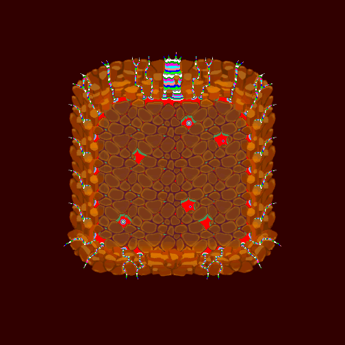

- **Relationship:** `ending_ground` (pret/pmd-red ground-map enum role, applied to the exact EU mapping row).
- **Dungeon:** ID 16, official French strings “Mine Magma-Fond” / “Mine Magma-Fond”, 3 playable floors.
- **Floor selection:** requested floor value `100`, runtime-clamped selector row `3`, property `152`, canonical tileset **70**.
- **Graphics resources:** tileset 70 uses graphics index 70 for FON/CEL/material; palette and CANM remain on tileset 70.
- **Equivalent base-game Ground geometry:** camera 63×63 tiles (504×504 px), source material grid 21×21 chunks, retained runtime material stride **64**.
- **Composition:** `special_emap_direct`; the selected special EMAP supplies canonical chunks directly.
- **Tick-zero PNG SHA-256:** `bfef2fc58b174c917121bba03c82172325a68b94c7d9da5a7d71a3d0e828d61e`.
- **Runtime chunk map SHA-256:** `2684a0e989022cafbc4d4609306844af2f6cd913f295c0f7ca53d4752064d331`.
- Detailed byte spans, source hashes, cycle records, and frame hashes: [`evidence.json`](d12p04/evidence.json), [`animation.json`](d12p04/animation.json).

### `d13p02` — Tour Céleste

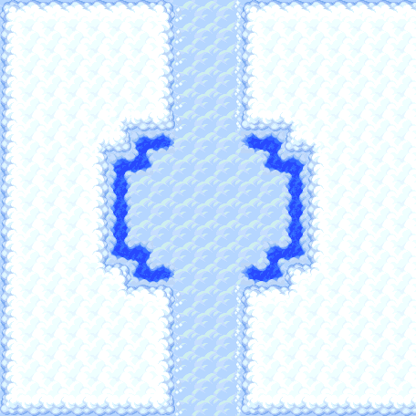

- **Relationship:** `midpoint_relay_ground` (pret/pmd-red ground-map enum role, applied to the exact EU mapping row).
- **Dungeon:** ID 17, official French strings “Tour Céleste” / “Tour Céleste”, 25 playable floors.
- **Floor selection:** requested floor value `100`, runtime-clamped selector row `25`, property `177`, canonical tileset **35**.
- **Graphics resources:** tileset 35 uses graphics index 35 for FON/CEL/material; palette and CANM remain on tileset 35.
- **Equivalent base-game Ground geometry:** camera 57×57 tiles (456×456 px), source material grid 19×19 chunks, retained runtime material stride **64**.
- **Composition:** `regular_cex_neighborhood`; deterministic CEX variant `0` with out-of-bounds terrain default `3`.
- **Tick-zero PNG SHA-256:** `20350e44ae0e836c2a31c0701661d74f23a8705f67c0d0404112fdf1daf82005`.
- **Runtime chunk map SHA-256:** `fb8152f1a142bc40ba5d1e19a1230f1faca6cd8dbf773645edaf06fd6408a642`.
- Detailed byte spans, source hashes, cycle records, and frame hashes: [`evidence.json`](d13p02/evidence.json), [`animation.json`](d13p02/animation.json).

### `d13p03` — Tour Céleste-Sommet

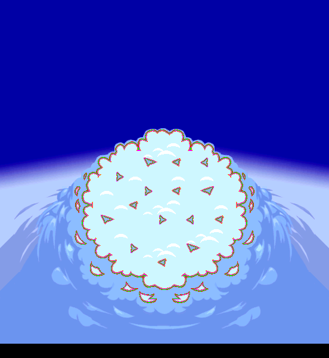

- **Relationship:** `ending_ground` (pret/pmd-red ground-map enum role, applied to the exact EU mapping row).
- **Dungeon:** ID 18, official French strings “Tour Céleste-Sommet” / “Tour Céleste-Sommet”, 9 playable floors.
- **Floor selection:** requested floor value `100`, runtime-clamped selector row `9`, property `186`, canonical tileset **71**.
- **Graphics resources:** tileset 71 uses graphics index 71 for FON/CEL/material; palette and CANM remain on tileset 71.
- **Equivalent base-game Ground geometry:** camera 69×75 tiles (552×600 px), source material grid 23×25 chunks, retained runtime material stride **64**.
- **Composition:** `special_emap_direct`; the selected special EMAP supplies canonical chunks directly.
- **Tick-zero PNG SHA-256:** `f94954263e0c4a2c794dd8d21efc22024cb6efd3653e12f962ac619d08449193`.
- **Runtime chunk map SHA-256:** `0d0ba498dce58d1e62cd6b472d416707342d151620ad53a45bb7641bc4b21c2f`.
- Detailed byte spans, source hashes, cycle records, and frame hashes: [`evidence.json`](d13p03/evidence.json), [`animation.json`](d13p03/animation.json).

### `d14p01` — Mer Houleuse

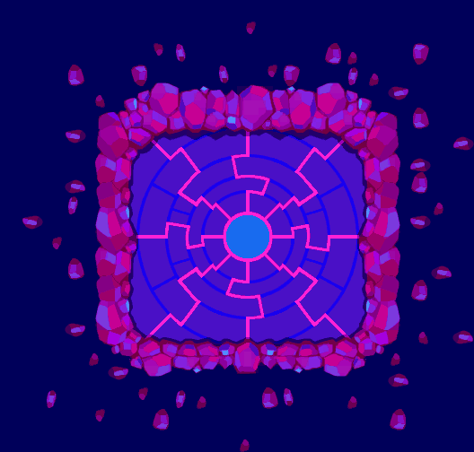

- **Relationship:** `fixed_dungeon_ground` (EU direct mapping row; the generic D14+ technical IDs do not encode a finer role).
- **Dungeon:** ID 19, official French strings “Mer Houleuse” / “Mer Houleuse”, 40 playable floors.
- **Floor selection:** requested floor value `100`, runtime-clamped selector row `40`, property `226`, canonical tileset **74**.
- **Graphics resources:** tileset 74 uses graphics index 74 for FON/CEL/material; palette and CANM remain on tileset 74.
- **Equivalent base-game Ground geometry:** camera 66×63 tiles (528×504 px), source material grid 22×21 chunks, retained runtime material stride **64**.
- **Composition:** `special_emap_direct`; the selected special EMAP supplies canonical chunks directly.
- **Tick-zero PNG SHA-256:** `1204c4ebdc644998036a04cf4a7a1b22c1495a106af3b1092bc7adf5c6c343b6`.
- **Runtime chunk map SHA-256:** `d66b4789e816494da8547052b88cfe0e7ee9749edd4e15061acc22fb9d895c64`.
- Detailed byte spans, source hashes, cycle records, and frame hashes: [`evidence.json`](d14p01/evidence.json), [`animation.json`](d14p01/animation.json).

### `d15p01` — Fosse d'Argent

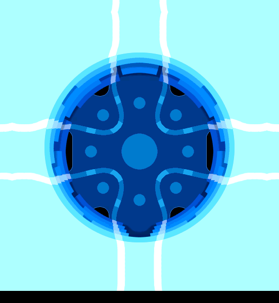

- **Relationship:** `fixed_dungeon_ground` (EU direct mapping row; the generic D14+ technical IDs do not encode a finer role).
- **Dungeon:** ID 20, official French strings “Fosse d'Argent” / “Fosse d'Argent”, 99 playable floors.
- **Floor selection:** requested floor value `100`, runtime-clamped selector row `99`, property `325`, canonical tileset **73**.
- **Graphics resources:** tileset 73 uses graphics index 73 for FON/CEL/material; palette and CANM remain on tileset 73.
- **Equivalent base-game Ground geometry:** camera 69×75 tiles (552×600 px), source material grid 23×25 chunks, retained runtime material stride **64**.
- **Composition:** `special_emap_direct`; the selected special EMAP supplies canonical chunks directly.
- **Tick-zero PNG SHA-256:** `ba5e5b4e99725349e6c8b0b8603825178cf7bd2a0ffb1cd9ea932aba11d72279`.
- **Runtime chunk map SHA-256:** `ae2c51dad364cd8b572598466025871e691e51974fca0bbe3f416f50d6e5b6c4`.
- Detailed byte spans, source hashes, cycle records, and frame hashes: [`evidence.json`](d15p01/evidence.json), [`animation.json`](d15p01/animation.json).

### `d16p01` — Terres de Feu

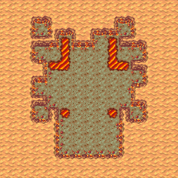

- **Relationship:** `fixed_dungeon_ground` (EU direct mapping row; the generic D14+ technical IDs do not encode a finer role).
- **Dungeon:** ID 34, official French strings “Terres de Feu” / “Terres de Feu”, 30 playable floors.
- **Floor selection:** requested floor value `100`, runtime-clamped selector row `30`, property `869`, canonical tileset **59**.
- **Graphics resources:** tileset 59 uses graphics index 59 for FON/CEL/material; palette and CANM remain on tileset 59.
- **Equivalent base-game Ground geometry:** camera 45×45 tiles (360×360 px), source material grid 15×15 chunks, retained runtime material stride **64**.
- **Composition:** `regular_cex_neighborhood`; deterministic CEX variant `0` with out-of-bounds terrain default `0`.
- **Tick-zero PNG SHA-256:** `a055753ef8b8c02730b4c2b08f20998bf01f30e1432ed4c20c461ab47cb675fa`.
- **Runtime chunk map SHA-256:** `3da91bf60c9e27074aceda5b6f90a07494135ca6d90db44535e4082cb30b6054`.
- Detailed byte spans, source hashes, cycle records, and frame hashes: [`evidence.json`](d16p01/evidence.json), [`animation.json`](d16p01/animation.json).

### `d17p01` — Terres de Foudre

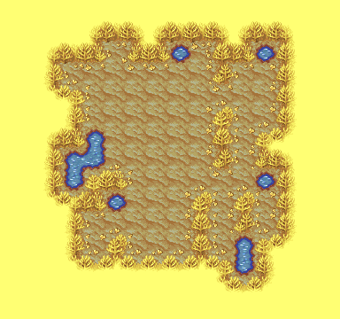

- **Relationship:** `fixed_dungeon_ground` (EU direct mapping row; the generic D14+ technical IDs do not encode a finer role).
- **Dungeon:** ID 37, official French strings “Terres de Foudre” / “Terres de Foudre”, 30 playable floors.
- **Floor selection:** requested floor value `100`, runtime-clamped selector row `30`, property `949`, canonical tileset **29**.
- **Graphics resources:** tileset 29 uses graphics index 29 for FON/CEL/material; palette and CANM remain on tileset 29.
- **Equivalent base-game Ground geometry:** camera 48×45 tiles (384×360 px), source material grid 16×15 chunks, retained runtime material stride **64**.
- **Composition:** `regular_cex_neighborhood`; deterministic CEX variant `0` with out-of-bounds terrain default `0`.
- **Tick-zero PNG SHA-256:** `e22abc4b735692fcc9c1270e7553f6f9825cf6206d31beec66717e6fca8f31bf`.
- **Runtime chunk map SHA-256:** `f04d0cecc65c6770ed563541bfc7c26f2ac8e268917383c6811d058aa6752f52`.
- Detailed byte spans, source hashes, cycle records, and frame hashes: [`evidence.json`](d17p01/evidence.json), [`animation.json`](d17p01/animation.json).

### `d18p01` — Terres Blizzard

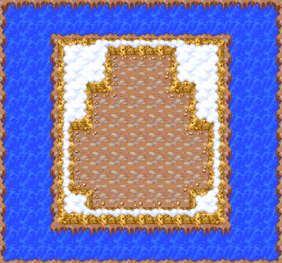

- **Relationship:** `fixed_dungeon_ground` (EU direct mapping row; the generic D14+ technical IDs do not encode a finer role).
- **Dungeon:** ID 35, official French strings “Terres Blizzard” / “Terres Blizzard”, 30 playable floors.
- **Floor selection:** requested floor value `100`, runtime-clamped selector row `30`, property `899`, canonical tileset **9**.
- **Graphics resources:** tileset 9 uses graphics index 9 for FON/CEL/material; palette and CANM remain on tileset 9.
- **Equivalent base-game Ground geometry:** camera 45×42 tiles (360×336 px), source material grid 15×14 chunks, retained runtime material stride **64**.
- **Composition:** `regular_cex_neighborhood`; deterministic CEX variant `0` with out-of-bounds terrain default `3`.
- **Tick-zero PNG SHA-256:** `4c6bb2c5ee7f79f6a46e7797ba146efb43ec04e8ea4ff247a38536bd3280d7f5`.
- **Runtime chunk map SHA-256:** `0eef83f23cac6bb72292337756465dcbd14956cc7f74504495df5f5d6f8c06ca`.
- Detailed byte spans, source hashes, cycle records, and frame hashes: [`evidence.json`](d18p01/evidence.json), [`animation.json`](d18p01/animation.json).

### `d19p01` — Pic Inaccessible

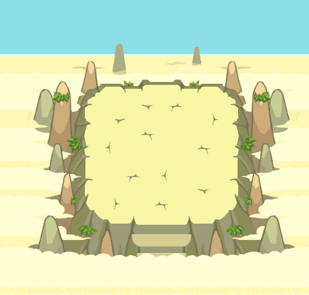

- **Relationship:** `fixed_dungeon_ground` (EU direct mapping row; the generic D14+ technical IDs do not encode a finer role).
- **Dungeon:** ID 60, official French strings “Pic Inaccessible” / “Pic Inaccessible”, 40 playable floors.
- **Floor selection:** requested floor value `100`, runtime-clamped selector row `40`, property `1564`, canonical tileset **72**.
- **Graphics resources:** tileset 72 uses graphics index 72 for FON/CEL/material; palette and CANM remain on tileset 72.
- **Equivalent base-game Ground geometry:** camera 66×63 tiles (528×504 px), source material grid 22×21 chunks, retained runtime material stride **64**.
- **Composition:** `special_emap_direct`; the selected special EMAP supplies canonical chunks directly.
- **Tick-zero PNG SHA-256:** `2df7f93a24355beb2fd8055461e91cff45735fe28ba3d2837cf7ae069cdceaae`.
- **Runtime chunk map SHA-256:** `d9d8d01779f089692a5f90bba0f8f84c879bd11badba64dad777293a842e24f0`.
- Detailed byte spans, source hashes, cycle records, and frame hashes: [`evidence.json`](d19p01/evidence.json), [`animation.json`](d19p01/animation.json).

### `d20p01` — Grotte Ouest

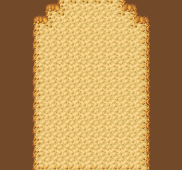

- **Relationship:** `fixed_dungeon_ground` (EU direct mapping row; the generic D14+ technical IDs do not encode a finer role).
- **Dungeon:** ID 23, official French strings “Grotte Ouest” / “Grotte Ouest”, 99 playable floors.
- **Floor selection:** requested floor value `100`, runtime-clamped selector row `99`, property `448`, canonical tileset **38**.
- **Graphics resources:** tileset 38 uses graphics index 30 for FON/CEL/material; palette and CANM remain on tileset 38.
- **Equivalent base-game Ground geometry:** camera 45×42 tiles (360×336 px), source material grid 15×14 chunks, retained runtime material stride **64**.
- **Composition:** `regular_cex_neighborhood`; deterministic CEX variant `0` with out-of-bounds terrain default `0`.
- **Tick-zero PNG SHA-256:** `aabb5cdf921cc5c77838a31303760dc7f5f07d0cb1d4fe20c803b2c5dc47b074`.
- **Runtime chunk map SHA-256:** `1aa3a7acf40fbf63b863624b1f04286f79a0b2dcff8cbb6a1673bcc423795df9`.
- Detailed byte spans, source hashes, cycle records, and frame hashes: [`evidence.json`](d20p01/evidence.json), [`animation.json`](d20p01/animation.json).

### `d21p01` — Mts Septentrion

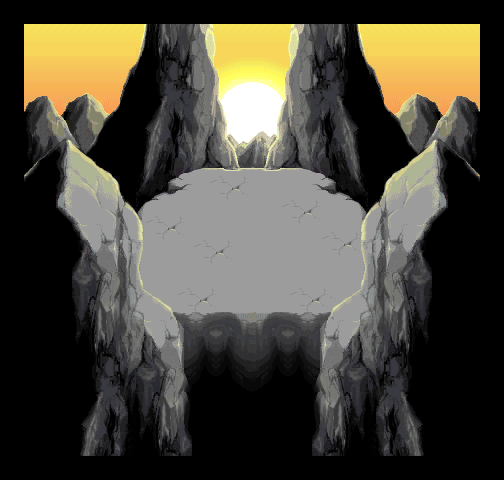

- **Relationship:** `fixed_dungeon_ground` (EU direct mapping row; the generic D14+ technical IDs do not encode a finer role).
- **Dungeon:** ID 29, official French strings “Mts Septentrion” / “Mts Septentrion”, 25 playable floors.
- **Floor selection:** requested floor value `100`, runtime-clamped selector row `25`, property `727`, canonical tileset **75**.
- **Graphics resources:** tileset 75 uses graphics index 75 for FON/CEL/material; palette and CANM remain on tileset 75.
- **Equivalent base-game Ground geometry:** camera 63×60 tiles (504×480 px), source material grid 21×20 chunks, retained runtime material stride **64**.
- **Composition:** `special_emap_direct`; the selected special EMAP supplies canonical chunks directly.
- **Tick-zero PNG SHA-256:** `48ca22e4b077fee4e8e629e690bec58f0cddc6a082c2cb9be3cb4f3b53935636`.
- **Runtime chunk map SHA-256:** `e3720429136bc804088283c5a8637fcb595557fbf4fccd56ca3a92d75ade6626`.
- Detailed byte spans, source hashes, cycle records, and frame hashes: [`evidence.json`](d21p01/evidence.json), [`animation.json`](d21p01/animation.json).

### `d23p01` — Grotte des Voeux

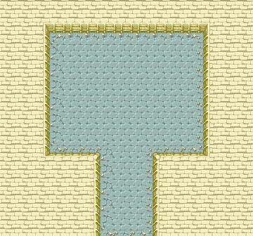

- **Relationship:** `fixed_dungeon_ground` (EU direct mapping row; the generic D14+ technical IDs do not encode a finer role).
- **Dungeon:** ID 26, official French strings “Grotte des Voeux” / “Grotte des Voeux”, 99 playable floors.
- **Floor selection:** requested floor value `20`, runtime-clamped selector row `20`, property `499`, canonical tileset **7**.
- **Graphics resources:** tileset 7 uses graphics index 7 for FON/CEL/material; palette and CANM remain on tileset 7.
- **Equivalent base-game Ground geometry:** camera 45×42 tiles (360×336 px), source material grid 15×14 chunks, retained runtime material stride **64**.
- **Composition:** `regular_cex_neighborhood`; deterministic CEX variant `0` with out-of-bounds terrain default `0`.
- **Tick-zero PNG SHA-256:** `20c0f33fe0c8c1afe97205ef414ef64d5e490921ea0326ab2570c2c308541c04`.
- **Runtime chunk map SHA-256:** `e22be880b8d670c33255e58bbeb08c6b33cfafe96305adad3c42e929d5f256a0`.
- Detailed byte spans, source hashes, cycle records, and frame hashes: [`evidence.json`](d23p01/evidence.json), [`animation.json`](d23p01/animation.json).

### `d25p01` — Bois Hurlement

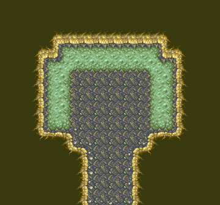

- **Relationship:** `fixed_dungeon_ground` (EU direct mapping row; the generic D14+ technical IDs do not encode a finer role).
- **Dungeon:** ID 53, official French strings “Bois Hurlement” / “Bois Hurlement”, 15 playable floors.
- **Floor selection:** requested floor value `100`, runtime-clamped selector row `15`, property `1271`, canonical tileset **61**.
- **Graphics resources:** tileset 61 uses graphics index 48 for FON/CEL/material; palette and CANM remain on tileset 61.
- **Equivalent base-game Ground geometry:** camera 45×42 tiles (360×336 px), source material grid 15×14 chunks, retained runtime material stride **64**.
- **Composition:** `regular_cex_neighborhood`; deterministic CEX variant `0` with out-of-bounds terrain default `0`.
- **Tick-zero PNG SHA-256:** `13ed441de709041750002a6acd493505202127adc36ed2a394c58bc4ac6527e7`.
- **Runtime chunk map SHA-256:** `02a960ad73497dd5d36be334bf8c897bc7af308e3944c22968f4ebe658bc962e`.
- Detailed byte spans, source hashes, cycle records, and frame hashes: [`evidence.json`](d25p01/evidence.json), [`animation.json`](d25p01/animation.json).

